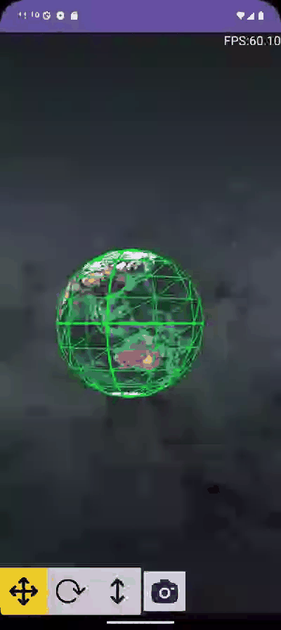
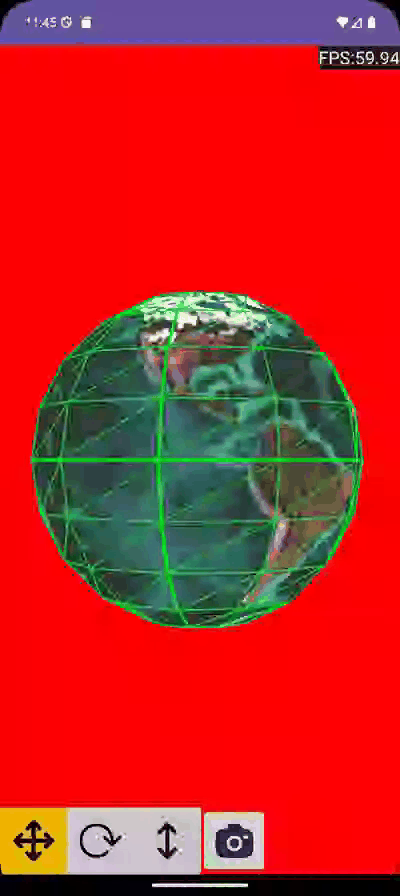
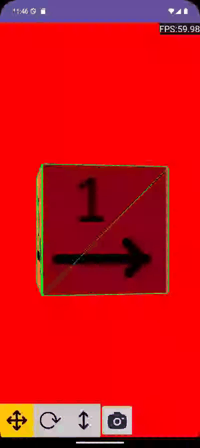
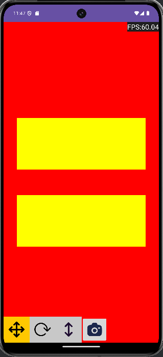
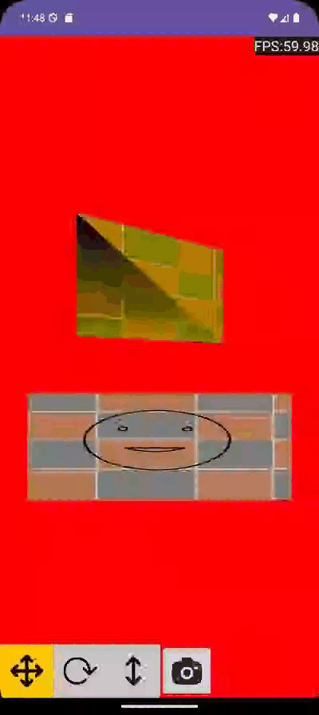
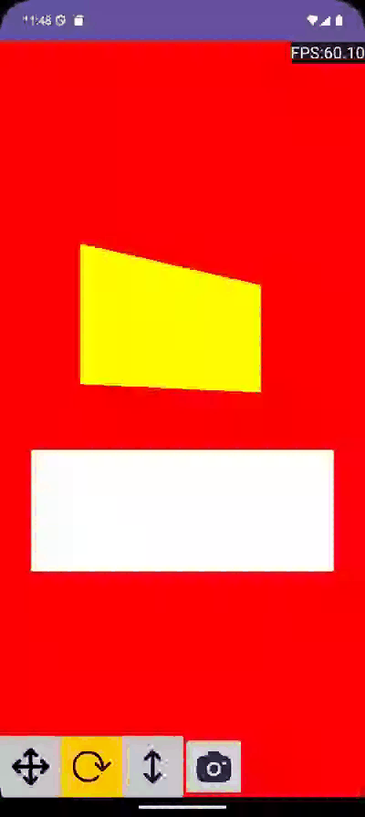
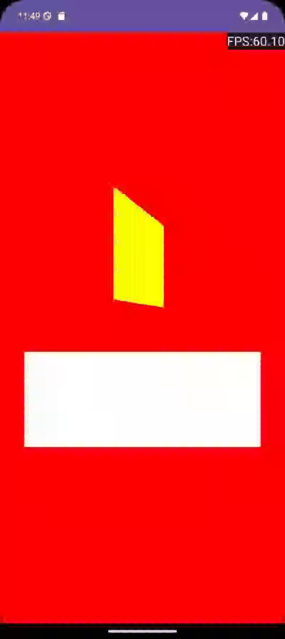

<h1> OpenGL ES for Android using the Java programming language  </h1>

 This repository contains the code for the video tutorial done be AIDE-CH on youtube: 

   

<a href="https://www.youtube.com/watch?v=jyo4ucUg-l4&list=PL809p4D7egYeNzDkWr80MZYrZiz3yF8H_">Open Youtube Playlist </a> 

<ul>
  <li>Video 10
    <ul>
        <li> skybox using a cubemap </li>
        <li>change the camera rotation and translation to use the function lookAt from the Matrix class </li>
    </ul>
    
  </li>
    <li>Video 09: create sphere using
    <ul>
        <li> icosahidral</li>
        <li>spherical coordinate system </li>
    </ul>
    
  </li>
    <li>Video 08: create the following objects
    <ul>
        <li> Cube</li>
        <li> Wireframe </li>
    </ul>
    
  </li>
  <li>Video 07: create a simple libarary with the following modules
    <ul>
        <li> Core:  include the classes IReceiveInput, Camera, Program, Texture, VertexBuffer, Aobj, Ascene  </li>
        <li>CustomObjects: include the classes PObj, Cube, Sphere, and any custom mesh </li>
        <li> ui: include the classes Input, Scene which receive input from the user and render to the screen </li>
        <li>Utils: which include GlUtils, MatUtils, Utils </li>
    </ul>
    
  </li>
  <li>Video 06
    <ul>
        <li> Colors for vertices: glVertexAttribPointer </li>
        <li> Texture: Load resources, Create GL buffer and copy image to it, Generate Mipmap </li>
    </ul>
    
  </li>
  <li>Video 05
    <ul>
        <li> rotate/translate the camera (the view matrix) </li>
        <li> implement OnTouchListener/GestureDetector </li>
        <li> using 3 buttons to choose the mode of the scroll event of the GestureDetector.onScroll method </li>
        <li> implement a rest of the view matrix </li>
    </ul>
    
  </li>
  <li>Video 04 
    <ul>
        <li> create a rectangle using two triangles </li>
        <li> drawing two rectangles using two vertex arrays </li>
        <li> adding model, view, and projection matrices to the vertex shader </li>
        <li> using the model matrix to rotate one object </li>
        <li> Adding textview to display the frames per seconds to the activity </li>
    </ul>
    
  </li>
  <li>Video 03 
    <ul>
        <li> create assets file for fragment and vertex shaders </li>
        <li> load shaders from assets </li>
        <li> check compilation errors for the shaders and link errors of the program </li>
        <li> draw multiple triangles and more about glDrawArrays </li>
    </ul>
    
  </li>
  <li> Video 02
    <ul>
        <li> vertex/fragment shaders </li>
        <li> creating vertex arrays </li>
        <li> creating vertex buffers and copying vertex data to them </li>
        <li> drawing triangle </li>
    </ul>
    

  </li>
  <li> Video 01
    <ul>
        <li> create an android activity </li>
        <li> add openGL surface to the activity </li>
        <li> set the clear color and clear the openGL buffers </li>
    </ul>
    

  </li>
</ul>
