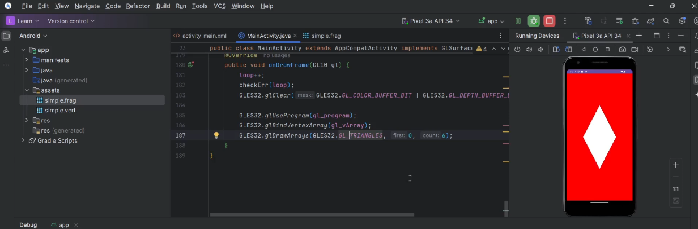
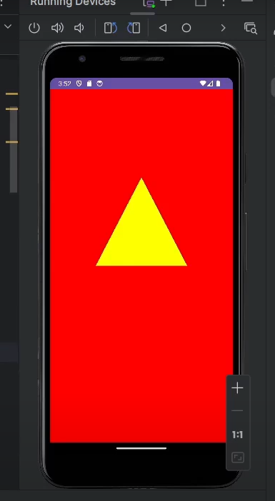
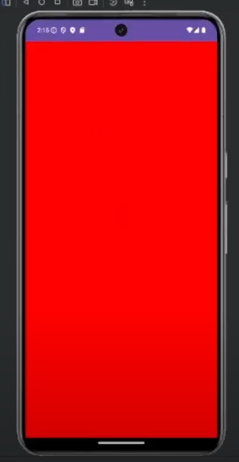

<h1> OpenGL ES for Android using the Java programming language  </h1>

 This repository contains the code for the video tutorial done be AIDE-CH on youtube: 

   

<a href="https://www.youtube.com/watch?v=jyo4ucUg-l4&list=PL809p4D7egYeNzDkWr80MZYrZiz3yF8H_">Open Youtube Playlist </a> 

<ol>
  <li>Video 03 
    <ul>
        <li> create assets file for fragment and vertex shaders </li>
        <li> load shaders from assets </li>
        <li> check compilation errors for the shaders and link errors of the program </li>
        <li> draw multiple triangles and more about glDrawArrays </li>
    </ul>
    
  </li>
  <li> Video 02
    <ul>
        <li> vertex/fragment shaders </li>
        <li> creating vertex arrays </li>
        <li> creating vertex buffers and copying vertex data to them </li>
        <li> drawing triangle </li>
    </ul>
    

  </li>
  <li> Video 01
    <ul>
        <li> create an android activity </li>
        <li> add openGL surface to the activity </li>
        <li> set the clear color and clear the openGL buffers </li>
    </ul>
    

  </li>
</ol>
